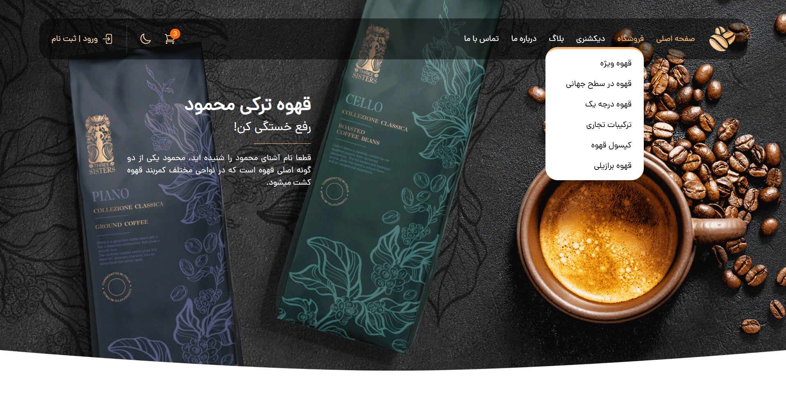

> **WARNING:** This project is not completed, still under development!



# Tailwind Coffee Shop
A modern, responsive Coffee Shop website built with Tailwind CSS v4 and JavaScript. This project supports RTL (Right-to-Left) language, dark mode, and includes e-commerce features such as a shopping cart.

## Features

- Responsive design for desktop and mobile devices
- Dark mode toggle for light and dark themes
- Shopping cart with dropdown and off-canvas menu
- RTL language support (Persian/Arabic)
- Navigation menu with dropdowns for shop categories
- Interactive UI with smooth transitions and overlays

## Technologies Used

- HTML5
- Tailwind CSS v4 for utility-first styling
- Vanilla JavaScript for interactivity and UI behavior

## Installation and Usage

1. Ensure you have Node.js and npm installed on your system.
2. Navigate to the project directory in your terminal.
3. Install Tailwind CSS v4 and other dependencies by running:
   ```
   npm install tailwindcss@4
   ```
4. Build the Tailwind CSS output by running:
   ```
   npx tailwindcss -i ./src/input.css -o ./output.css --watch
   ```
5. Open the `src/index.html` file in your preferred web browser to view the project.

*Note:* The project uses Tailwind CSS v4, so ensure the correct version is installed to avoid compatibility issues.

## Project Structure

```
d:/Tailwind Coffee Shop/
├── src/
│   ├── index.html          # Main HTML file
│   ├── input.css           # Tailwind CSS input file
│   ├── scripts/
│   │   └── app.js          # JavaScript for UI interactivity
│   ├── fonts/              # Custom fonts used in the project
│   └── media/              # Images, icons, and other media assets
├── README.md               # This file
├── package.json            # Project metadata and dependencies (if any)
└── package-lock.json       # Lockfile for npm dependencies
```

## License

This project does not currently include a license.

## Contact

For any questions or feedback, please contact the project maintainer.
